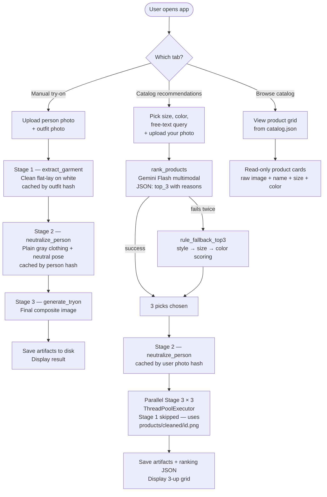

# Meesa Nano Banana 2 — Try-On Flow (Experimental)

> **Status:** experimental. This document captures the current pipeline and the features built so far. The final approach may differ — for the full decision log and the experiments we've already tried (and reverted), see `CLAUDE.md`.

A local Streamlit app that experiments with Google's **Nano Banana 2** (`gemini-3.1-flash-image-preview`) for virtual try-on. The user uploads a person photo + an outfit photo and gets back a photorealistic image of that person wearing that outfit.

A second experiment is layered on top: a **catalog recommender** that ranks a small store catalog with Gemini Flash multimodal and runs try-on on the top 3 picks in parallel.

---

## End-to-end workflow diagram



---

## Stack

| Layer | Choice |
|---|---|
| Language | Python 3.12 (pinned via `.python-version`) |
| Package manager | `uv` (not pip) |
| UI | Streamlit |
| Image-generation model | `gemini-3.1-flash-image-preview` ("Nano Banana 2") |
| Ranker model | `gemini-2.5-flash` (multimodal, JSON output) |
| SDK | `google-genai` (the unified SDK, not the deprecated `google-generativeai`) |
| Image I/O | Pillow |
| Env loading | python-dotenv |

---

## Features built so far

### 1. Manual try-on

Upload any person photo + any outfit photo, get a try-on back.

- **Person input:** full-body or waist-up; ideally one person in frame.
- **Outfit input:** flat-lay product shot OR a screenshot of someone wearing the outfit (the pipeline extracts only the clothing).
- **UI:** three columns — Person | Outfit | Result. A single primary button (auto-renames "Generate try-on" → "Regenerate" once a result exists), plus a Download button for the final PNG.

### 2. Catalog recommendations

Form-driven shopping flow:

- **Size** selectbox — populated from `products/catalog.json`
- **Color** selectbox — populated from `products/catalog.json`
- **What kind of outfit?** free-text input (e.g. "flowy summer dress", "kurta")
- **Your photo** file uploader

Gemini Flash ranks the catalog (using both the product JSON and product images) and returns top 3 picks with a one-line reason each. The 3-stage try-on pipeline then runs on all 3 picks in parallel. Results display as a 3-up grid with the try-on result, the original product thumbnail + size/color chips, the "Why we picked this" reason, and a per-card Regenerate button.

A global "Re-rank & try on" button regenerates the whole grid with the same inputs.

**Ranking priority (strict):**

1. **Kind of outfit / style** — dominant signal. A kurta query never recommends a dress just because size/color match.
2. **Size match** — secondary, used to rank among style-matching candidates.
3. **Color match** — final tie-breaker.

If the LLM ranker fails twice (parse error, hallucinated id), a deterministic **rule fallback** kicks in (style=+1000, size=+100, color=+10) and the result is annotated with a disclosure caption.

### 3. Browse catalog

Read-only grid of all products from `products/catalog.json`. Three columns, each card showing the raw product image, name, size, color, and id. No try-on, no LLM — a quick way to see what's in the store.

---

## The 3-stage try-on pipeline

Why three stages? Early experiments showed naive single-call try-on hits two structural problems:

1. **Body-bleed** — the model imports the slim/elongated body of a mannequin or reference model in the outfit photo.
2. **Clothed-silhouette anchoring** — the model treats the original outfit's silhouette as the body, so loose clothing makes the subject look fuller.

The three stages decouple these references and address each independently. (See `CLAUDE.md` for the full history of how we landed here, including Tier B, Tier C, and the reverted v6/rembg attempts.)

### Stage 1 — `extract_garment(outfit_img)`

Takes the outfit photo (any messy form — mannequin, model, cluttered background) and re-renders it as a **clean product flat-lay on pure white**.

- Removes mannequins, models, accessories, background scenery.
- Preserves colors, patterns, embroidery, cut, length, neckline, sleeves.
- Returns `(cleaned_image, status)` where status is `'cached' | 'extracted' | 'fallback'`.
- **Cached** by SHA-256 of preprocessed outfit bytes — re-uploading the same outfit hits the cache for ~$0.

### Stage 2 — `neutralize_person(person_img)`

Takes the person photo and re-renders the **same person** wearing plain gray form-fitting clothing in a neutral standing pose.

- Commits to the person's actual body shape, free from the original outfit's silhouette.
- Preserves: identity, face, ethnicity, age, hair, skin, background, framing.
- Replaces: pose (now neutral, arms at sides), clothing (now plain gray T-shirt + pants).
- Returns `(neutralized_image, status)` where status is `'cached' | 'extracted' | 'fallback'`.
- **Cached** by SHA-256 of preprocessed person bytes.

### Stage 3 — `generate_tryon(neutralized_person, cleaned_outfit)`

The main composite call. Takes the neutralized person and the cleaned outfit, produces the final try-on.

- **Subject's body is the canvas** — every other element adapts to it.
- **Pose adapts to the garment** — hands-in-pockets becomes hands-at-sides for a pocketless kurta; for a saree, hands may rest on the pallu; for a gown, on the hem.
- Identity, hair, skin, background, framing all preserved from the FIRST image.
- Colors, patterns, cut, length, neckline, sleeves taken from the SECOND image.

### Soft fallback

Every stage returns a `status` enum. If a stage fails (network error, safety block, malformed response):

- Returns the **preprocessed original image** instead of the cleaned/neutralized one.
- Sets `status='fallback'`.
- The downstream stage runs normally with the raw input.
- The UI shows a quiet disclosure caption: *"Outfit preprocessing and/or body-shape preprocessing was unavailable for this image; result quality may be reduced."*

Partial failure never blocks the user — they always get a result, just with a caveat.

---

## Input preprocessing

Applied to every image before it touches the Gemini API (in `llm.preprocess`):

1. **EXIF auto-rotate** — phone photos store rotation in metadata; without this step Gemini would see sideways pixels.
2. **RGB convert** — strips alpha channel from PNGs. Gemini's image-gen endpoint doesn't accept RGBA.
3. **Longest-edge cap (1536px)** — proportional resize so neither dimension exceeds 1536px. Prevents bloated payloads.

---

## Output

- Aspect ratio of the final image matches the person photo, snapped to the nearest Gemini-supported ratio: `1:1, 2:3, 3:2, 3:4, 4:3, 9:16, 16:9, 21:9`.
- Resolution: 1K (Nano Banana 2 default).
- Format: PNG, millisecond-precision timestamp prefix.
- Manual-tab artifacts (per generation):
  - `images/{ts}_person.png`
  - `images/{ts}_outfit.png`
  - `images/{ts}_outfit_cleaned.png` (only if Stage 1 succeeded)
  - `images/{ts}_person_neutralized.png` (only if Stage 2 succeeded)
  - `generated/{ts}_tryon.png`
- Catalog-tab artifacts (per request):
  - `images/{ts}_catalog_person.png`
  - `images/{ts}_catalog_person_neutralized.png` (if Stage 2 succeeded)
  - `generated/{ts}_catalog_rank{1,2,3}_{id}.png`
  - `generated/{ts}_catalog_ranking.json` — full audit trail (user attrs, ranker status, picks with reasons, errors)
- **SynthID watermark** — Google embeds an invisible watermark in every Nano Banana 2 output. A consent caption at the top of the app discloses this.

---

## Caching

Both Stage 1 and Stage 2 use disk caching keyed by the SHA-256 hash of the preprocessed input bytes.

- **Stage 1 cache** — same outfit re-uploaded → instant hit (~0.05s).
- **Stage 2 cache** — same person re-uploaded → instant hit (~0.05s).
- **Cache location** — `images/cache/{sha256}.png`. Gitignored by the `images/*` rule.
- **No TTL** — cache entries live forever (until manually deleted).
- **Catalog products** — Stage 1 is **pre-warmed** at setup time via `scripts/clean_catalog.py`; the results are committed at `products/cleaned/{id}.png` so the catalog tab never re-runs Stage 1 at request time.

---

## Cost & latency model

### Manual tab

| Scenario | Cost | Wall time |
|---|---|---|
| Fresh person + fresh outfit | **~$0.21** | 60–90s |
| Same person, new outfit | ~$0.14 | 30–60s |
| New person, same outfit | ~$0.14 | 30–60s |
| Both cached (regenerate same combo) | **~$0.07** | 15–30s |

### Catalog tab

| Phase | Cold | Warm caches |
|---|---|---|
| Ranker call | ~$0.01, 5–10s | same |
| Stage 1 (catalog products) | $0, instant (read PNG) | same |
| Stage 2 (user photo) | ~$0.07, 25–45s | $0, instant |
| Stage 3 × 3 (parallel) | ~$0.21, 30–60s | same |
| **Total** | **~$0.29 / 60–115s** | **~$0.22 / 35–70s** |

One-time setup cost for catalog: `scripts/clean_catalog.py` ≈ ~$0.70 / ~4 min for a 10-product catalog.

---

## Setup

### 1. Install dependencies

```bash
uv venv
uv sync
```

### 2. Configure the Gemini API key

```bash
cp .env.example .env
# then edit .env and paste your key from https://aistudio.google.com/apikey
```

Variable name: `GEMINI_API_KEY`. The app refuses to start without it.

### 3. (Catalog tab only) Set up the product catalog

The repo ships with a 10-product sample catalog. To use it as-is:

1. Drop each product's raw image at `products/raw/{id}.jpg` (P01.jpg, P02.jpg, …).
2. Pre-extract clean flat-lays (one-time):

   ```bash
   uv run python scripts/clean_catalog.py
   ```

   Idempotent — re-runs skip products whose cleaned file already exists.

3. Commit `products/cleaned/*.png` so other clones don't have to re-run the cleaner.

To customize the catalog, edit `products/catalog.json` and add matching raw images.

### 4. Run the app

```bash
uv run streamlit run app.py
```

Opens at <http://localhost:8501>.

---

## Project structure

```
meesa_tryout/
├── app.py                          # Streamlit UI — 3 tabs, all flows
├── llm.py                          # Gemini client + pipeline functions
├── prompt.py                       # All prompt constants
├── catalog.py                      # Product loader + rule fallback ranker
├── scripts/
│   └── clean_catalog.py            # One-time pre-extract for catalog products
├── products/
│   ├── catalog.json                # Store catalog (10 products)
│   ├── README.md                   # Catalog schema + setup notes
│   ├── raw/{id}.jpg                # Raw product photos (you provide)
│   └── cleaned/{id}.png            # Pre-extracted flat-lays (committed)
├── images/                         # Saved user uploads (gitignored)
│   └── cache/{sha256}.png          # Stage 1 + Stage 2 disk cache
├── generated/                      # Saved try-on outputs (gitignored)
├── pyproject.toml                  # uv-managed deps
├── uv.lock                         # Lockfile (committed)
├── .python-version                 # 3.12
├── .env.example                    # Template (committed)
├── .env                            # GEMINI_API_KEY (gitignored)
├── .gitignore
├── CLAUDE.md                       # Full decision log (every experiment, including reverts)
└── meesanb2_flow.md                # This file
```

---

## Module reference

### `llm.py`

| Symbol | Purpose |
|---|---|
| `MODEL_ID` | Pinned image-gen model: `gemini-3.1-flash-image-preview` |
| `RANKER_MODEL_ID` | Pinned ranker model: `gemini-2.5-flash` |
| `MAX_EDGE = 1536` | Longest-edge cap for input preprocessing |
| `TIMEOUT_MS = 120_000` | Per-call network timeout |
| `CACHE_DIR` | `images/cache/` — Stage 1 + Stage 2 disk cache |
| `preprocess(img)` | RGB convert + EXIF auto-rotate + resize ≤1536px |
| `extract_garment(outfit)` | Stage 1; returns `(Image, status)` |
| `neutralize_person(person)` | Stage 2; returns `(Image, status)` |
| `generate_tryon(person, outfit)` | Stage 3; returns the composite image |
| `rank_products(catalog, user_attrs)` | Ranker; returns `list[RankingPick]`; retries once on parse failure |
| `tryon_batch(neutralized, picks)` | Parallel Stage 3 × 3 via `ThreadPoolExecutor` |
| `tryon_single_pick(neutralized, pick)` | Single Stage 3 for per-card regenerate |
| `TryOnError` | Friendly exception for image-gen failures |
| `RankerError` | Raised when ranker fails after retry; caller falls back to rule ranker |
| `RankingPick` | `(product, reason)` |
| `BatchResult` | `(product, reason, image | None, error | None)` — exactly one of image/error set |

### `prompt.py`

All locked prompts:

- `EXTRACT_GARMENT_INSTRUCTION` — Stage 1 prompt
- `NEUTRALIZE_PERSON_INSTRUCTION` — Stage 2 prompt
- `TRY_ON_INSTRUCTION` — Stage 3 prompt (currently v5)
- `RANK_PRODUCTS_INSTRUCTION` — Ranker prompt (style-first priority)

Versioning convention: future revisions get `_V2` suffix for A/B testing.

### `catalog.py`

| Symbol | Purpose |
|---|---|
| `Product` | Frozen dataclass: `id, name, size, color, image` |
| `load_catalog(path)` | Reads + validates `products/catalog.json` |
| `derive_sizes(catalog)` | Unique sizes (case-insensitive dedup) for size dropdown |
| `derive_colors(catalog)` | Unique colors (case-insensitive dedup) for color dropdown |
| `rule_fallback_top3(catalog, user_attrs)` | Deterministic top-3 picker; style=+1000, size=+100, color=+10 |
| `CatalogError` | Raised on malformed/missing catalog |

### `app.py` — session state keys

Manual tab (unprefixed):

- `person_bytes`, `outfit_bytes` — uploaded image bytes (persist across reruns)
- `result_image`, `result_path` — last generated try-on
- `outfit_status`, `person_status` — `'cached' | 'extracted' | 'fallback'` for disclosure caption
- `is_generating` — disables UI controls during a call

Catalog tab (prefixed `cat_`):

- `cat_person_bytes` — uploaded user photo bytes
- `cat_results` — `list[BatchResult]` for the 3-up grid
- `cat_neutralized` — PIL image, reused by per-card regenerate
- `cat_neutralize_status`, `cat_ranker_status` — for disclosure captions
- `cat_ts` — timestamp prefix for save filenames
- `cat_is_generating` — disables UI controls during a call

---

## Error handling

- **Missing `GEMINI_API_KEY`** — top-level `st.error` + `st.stop()`.
- **Safety block** (Gemini refuses to generate) — friendly `st.error` with the model's stated reason category.
- **No image in response** — friendly `st.error` suggesting different inputs.
- **Network / timeout** — friendly `st.error`; previous result + uploads preserved.
- **Stage 1 / Stage 2 failure** — soft fallback to raw input + disclosure caption.
- **Ranker failure** — retries once with a stricter prompt → falls back to rule-based ranker with disclosure caption.
- **Per-card try-on failure** — that card shows its inline error + product thumbnail; the other 2 cards still render.

No tracebacks reach the UI; everything is logged to stderr with namespaced prefixes (`[llm:extract]`, `[llm:neutralize]`, `[llm:tryon]`, `[llm:rank]`, `[llm:batch]`, `[app]`).

---

## Diagnostic logging

Every Gemini call logs:

- `finish_reason` (STOP / SAFETY / NO_IMAGE / etc.)
- Response anatomy: number of parts, inline-data parts, text parts
- Per-decode: MIME type, byte size, decoded PIL size

Stage 1 and Stage 2 also log cache HIT vs MISS vs FAIL. The catalog batch logs `[llm:batch] N/3 succeeded`.

All prints use a flushing wrapper (`log = functools.partial(print, flush=True)`) — Streamlit's stdout under a pipe is block-buffered, so without this prints can sit invisibly for many seconds.

---

## Known limitations (open experiments)

These are the current rough edges; potential next-experiment directions live in `CLAUDE.md` under "Reserved for future iterations."

- **Color drift on nuanced colors** — Stage 3 still re-renders the garment, so subtle dusty / heathered / muted colors can drift toward the model's training-distribution neutrals. (The kaftan mauve → taupe issue. See CLAUDE.md for the v6 + rembg pivot we tried and reverted.)
- **Some design-detail simplification** — Stage 1's flat-lay re-render can soften very fine embroidery / beadwork.
- **Latency variance** — Nano Banana 2 (preview) ranges from 15s to 60s per call. Hard to predict.
- **Rule fallback synonym matching** — the rule-based catalog ranker uses substring matching ("kurta" doesn't match "Kurti"). The LLM ranker handles synonyms; the fallback doesn't.

---

## See also

- **`CLAUDE.md`** — full project decision log. Every prompt iteration, every architecture pivot, every reverted experiment is recorded with rationale. Read it before making non-trivial changes — there's a lot of failed-experiment context that explains why the current design looks the way it does.
- **`products/README.md`** — catalog schema + setup notes.
